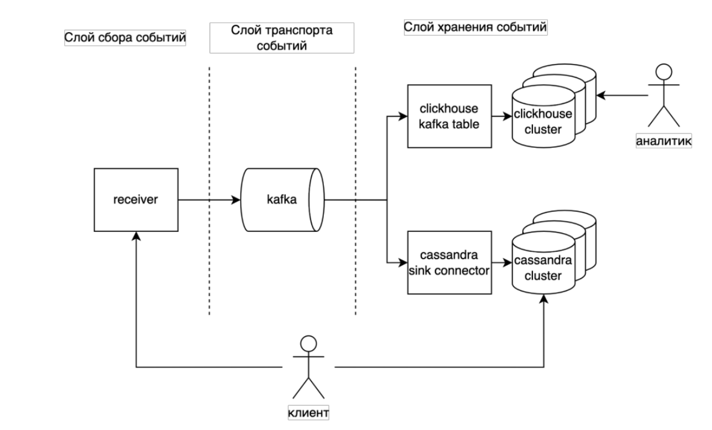
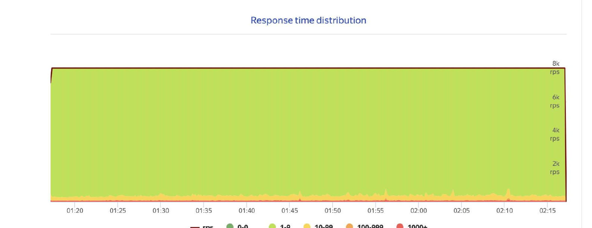
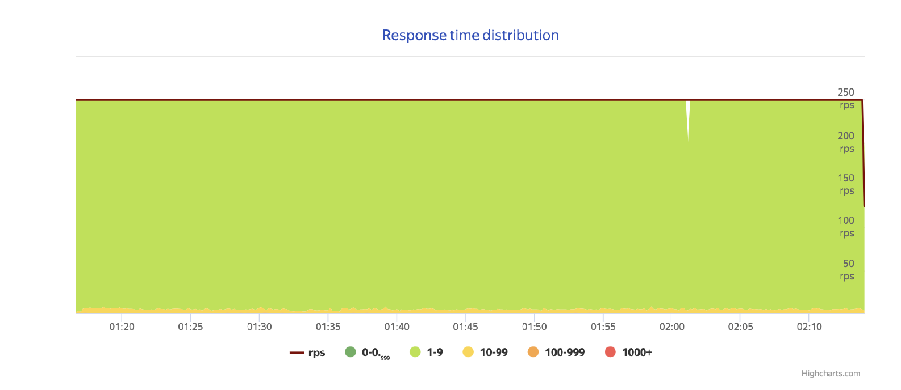
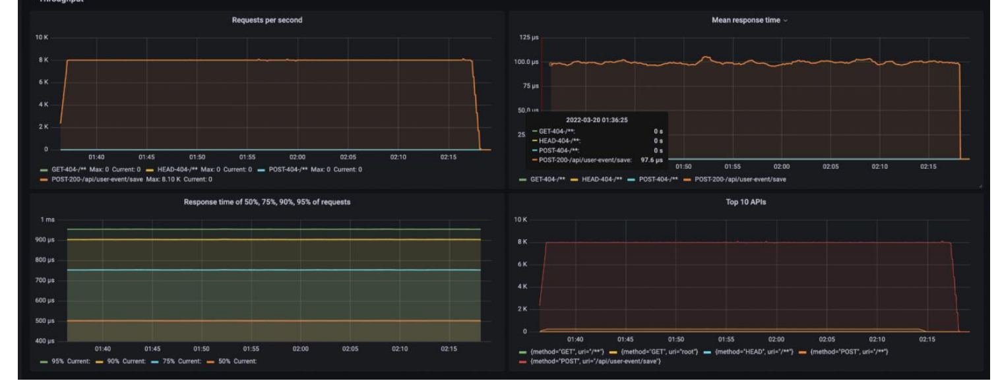
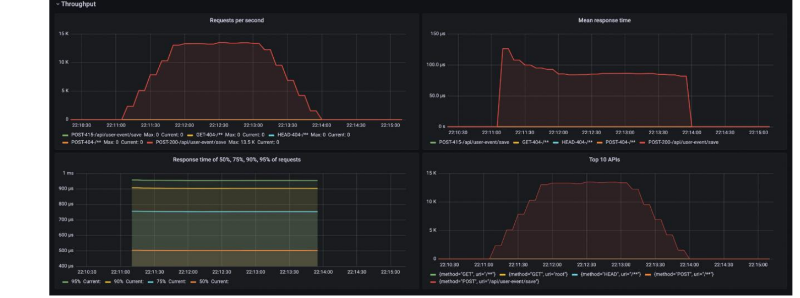

# Аналитическое хранилище для KION

Высоконагруженный сервис сбора и хранения истории просмотров пользователей онлайн-кинотеатра **KION** (МТС.Тета). Сохраняет поток пользовательских событий и отдаёт историю просмотров под высокой нагрузкой для рекомендательных и аналитических систем.

## Задача

Нужна надёжная система сбора и хранения событий пользователей с высокой пропускной способностью, гибкой масштабируемостью и отказоустойчивостью — без неё не работают ни рекомендации, ни бизнес-аналитика.

## Требования к системе

| Метрика | Значение |
|---|---|
| Нагрузка на запись событий | 8 000 RPS |
| Нагрузка на чтение | 250 RPS |
| Доступность сервиса | 99,9 % |
| Хранение | все события за всё время |

## Архитектура

Система состоит из трёх слоёв: **сбор** → **транспорт** → **хранение**.

<p align="center"></p>

- **Receiver** (Java, Spring, Embedded Jetty) — принимает и валидирует события по HTTP, кладёт в шину;
- **Kafka** — временное хранение и асинхронная доставка событий во все подсистемы;
- **Cassandra** (через Kafka Connect) — быстрое чтение истории событий пользователя по ключу (`user_id`);
- **ClickHouse** — аналитические SQL-запросы по всей истории событий;
- **Prometheus + Grafana** — метрики и мониторинг.

Такое разделение хранилищ решает главную проблему конкурентов (Ivi, Spotify, Netflix): колоночные/офлайн-хранилища (ClickHouse, Hadoop) плохо читают историю одного пользователя по ключу под нагрузкой, а LSM-хранилище (Cassandra) для этого создано.

## API

**Отправка события**

```bash
curl -X POST http://hostname:8081/api/user-event/save \
  -H "Authorization: Bearer <jwt>" \
  -d '{
    "user_id": 1,
    "video_id": 1,
    "event_type": 1,
    "event_time": 1
  }'
```

Коды ответа: `200` успех · `400` невалидный запрос · `401` отсутствует/невалиден JWT · `503` сервис перегружен, нужен ретрай.

**Чтение истории пользователя** (напрямую из Cassandra, CQL):

```sql
select * from kion.user_event where user_id = 1 limit 100;
```

## Технологии

Docker · Java/Spring/Jetty · Kafka + Kafka Connect · Cassandra · ClickHouse · Prometheus · Grafana · Yandex Tank / h2load (нагрузочное тестирование) · Swagger

## Результаты нагрузочного тестирования

Тестирование проводилось на 3 виртуальных дата-центрах в MTS Cloud (Xeon Gold 6254, 6 vCPU, 24 GB RAM). Запись и чтение прогонялись одновременно в течение часа целевой нагрузкой 8 000 RPS / 250 RPS.

**Запись — 8 000 RPS без деградации:**

<p align="center"></p>

**Чтение из Cassandra — стабильные 250 RPS:**

<p align="center"></p>

**Метрики receiver-сервиса (Grafana):** большинство запросов обрабатываются за 1–9 мс, среднее время ответа ~0.1 мс.

<p align="center"></p>

**Стресс-тест на запись** — найден предел пропускной способности цепочки receiver → Kafka → Kafka Connect → Cassandra на одном экземпляре каждого компонента: **~12 000 RPS**.

<p align="center"></p>

### Вывод

Сервис уверенно держит целевые 8 000 RPS на запись и 250 RPS на чтение с запасом (максимум ~12 000 RPS на запись, ~1 200 RPS на чтение при странице в 100 записей). Пропускная способность масштабируется горизонтально: запись — числом экземпляров receiver/Kafka Connect, чтение — размером кластера Cassandra.

## Запуск

Все компоненты контейнеризованы (Docker). Локальный запуск:

```bash
bash start-services.bash   # zookeeper → kafka → cassandra → clickhouse → kafka-connect → receiver → prometheus
bash stop-services.bash
```

Дашборд метрик — Grafana, конфиги окружений — `env.bash` в директории каждого компонента.

## Будущее развитие

- Автоматизация аналитики (отчёты, срезы, метрики);
- Интеграция с внешними системами и словарями для расширенной аналитики.

## Документация

Полная проектная документация (ТЗ, архитектура, тестирование, отчёты по итогам) — в [`documentation/`](documentation).
